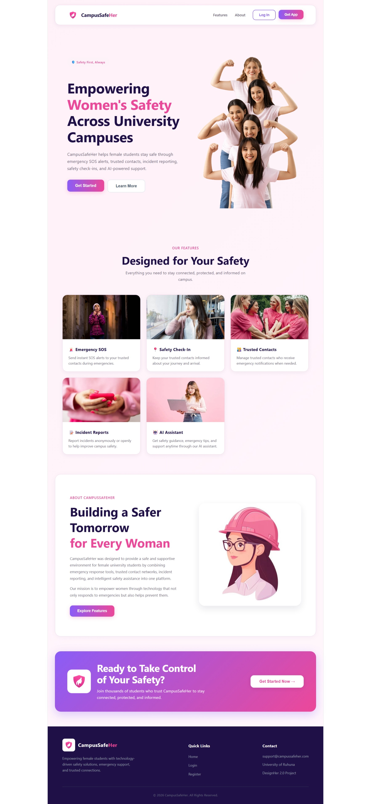
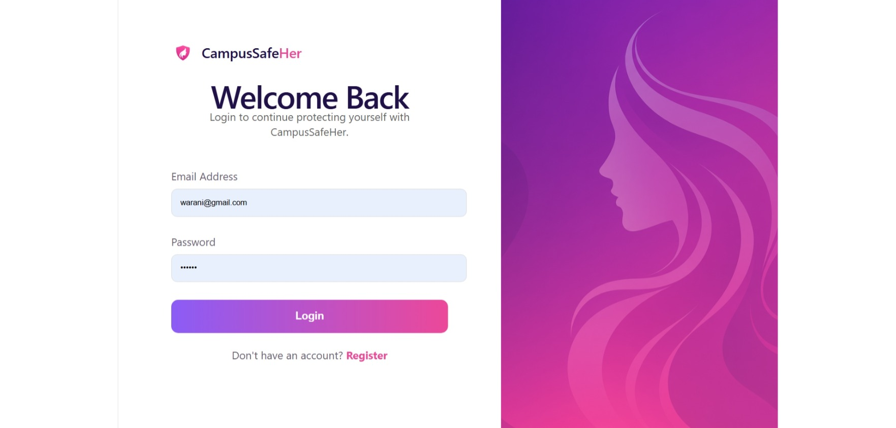
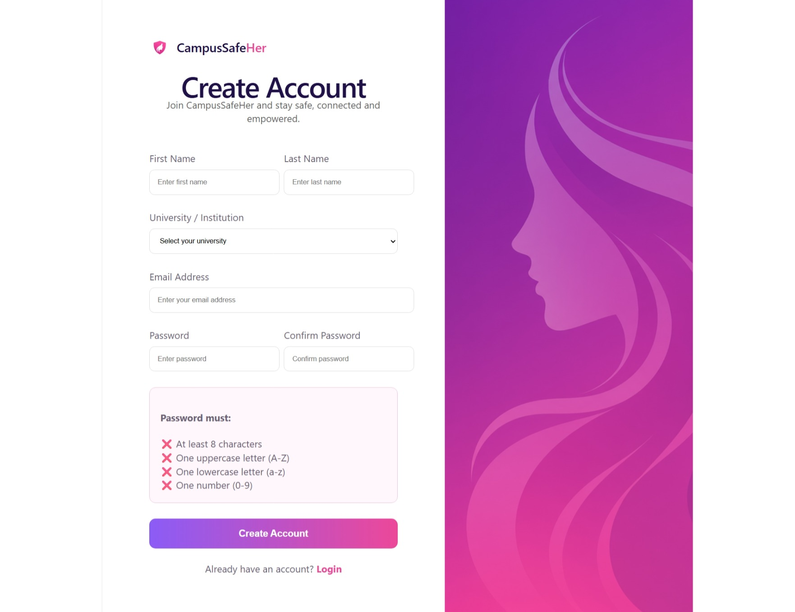
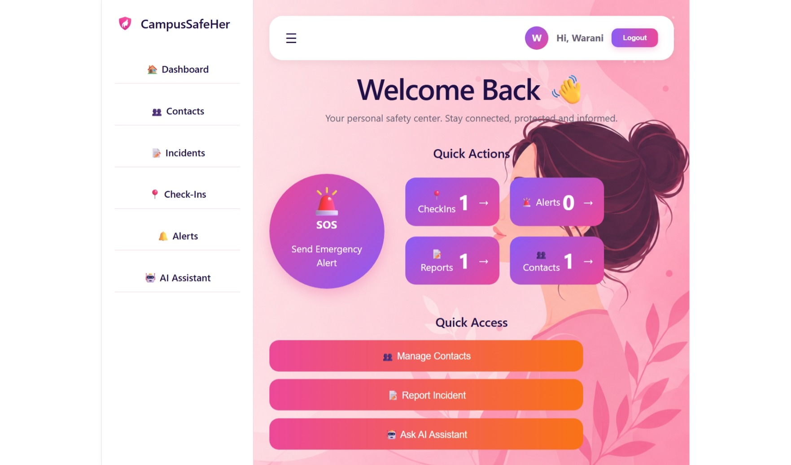
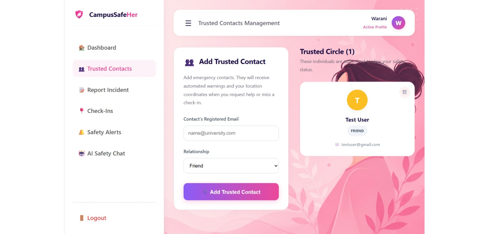
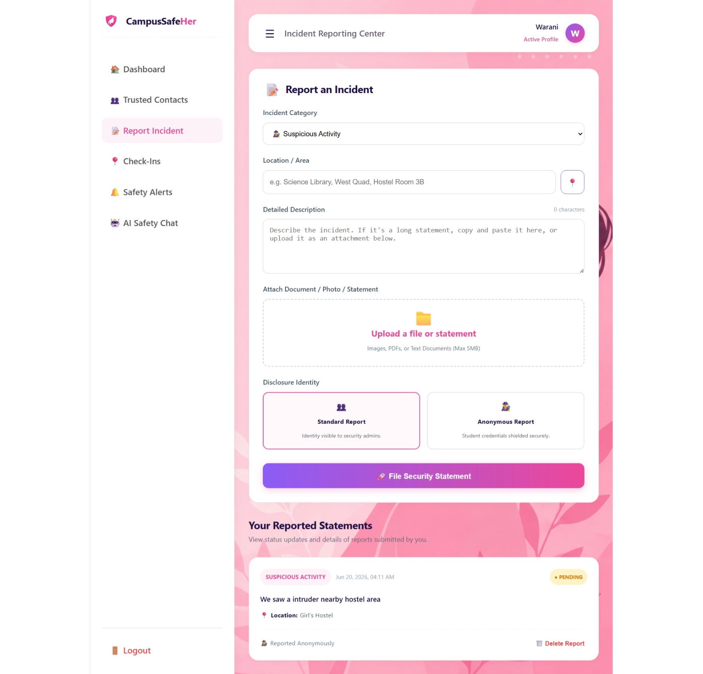
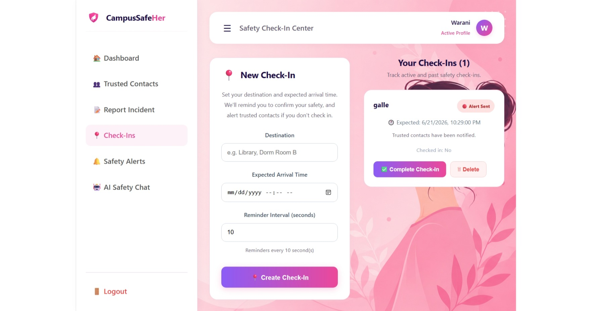
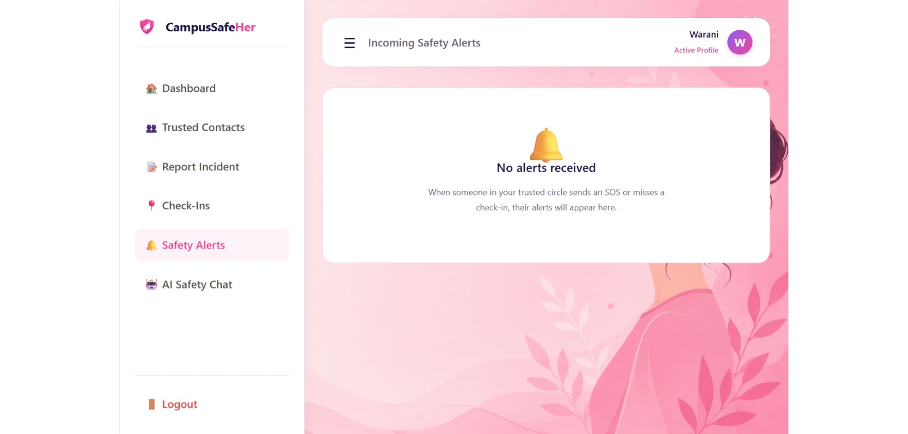
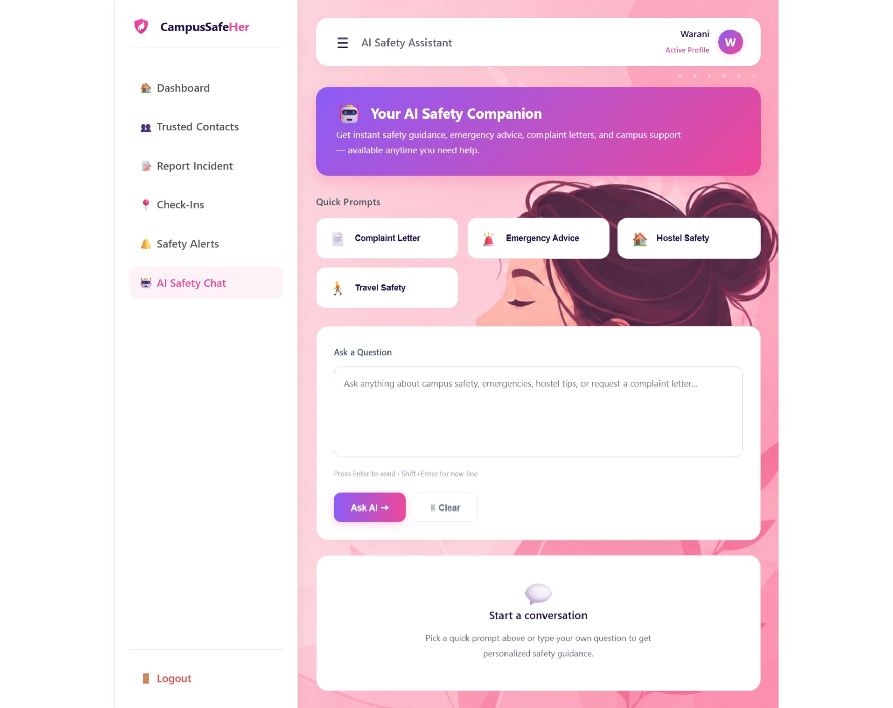
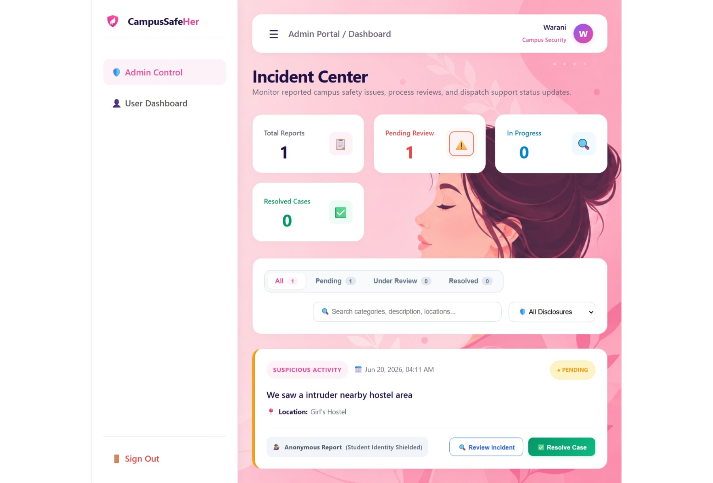

# CampusSafeHer

### AI-Powered Safety and Support Platform for Female University Students

---

## Problem Statement

Female university students often face safety concerns when traveling alone, returning to hostels late at night, reporting suspicious incidents, or seeking immediate assistance during emergencies.

Traditional communication channels are often slow, fragmented, and difficult to access during critical situations. As a result, students may struggle to quickly notify trusted contacts, report incidents, or obtain reliable safety guidance when needed.

CampusSafeHer was developed to address these challenges by providing a centralized, technology-driven safety platform designed specifically for female university students.

---

## Solution Overview

CampusSafeHer is a full-stack web application that enhances student safety through emergency response features, trusted contact management, intelligent assistance, and incident monitoring.

The platform allows users to:

- Send emergency SOS alerts with location information
- Manage trusted contacts
- Schedule safety check-ins
- Report safety incidents
- Receive AI-powered safety guidance
- Generate safety-related complaint letters and formal documents
- Access a modern and user-friendly safety dashboard

An administrative dashboard is also provided to monitor incidents and manage reports effectively.

---

## Technologies Used

### Frontend

- React
- Vite
- React Router DOM
- Axios
- CSS

### Backend

- Node.js
- Express.js

### Database

- MongoDB Atlas
- Mongoose

### Authentication & Security

- JWT (JSON Web Tokens)
- bcryptjs

### AI Integration

- Google Gemini API

### Additional Services

- Node Cron
- CORS
- dotenv

### Version Control

- Git
- GitHub

### Deployment

- Vercel (Frontend)
- Render (Backend)

---

## Architectural Diagram

---

## Key Features

### User Features

#### 🚨 Emergency SOS Alerts

- Instantly send emergency alerts
- Share current location with trusted contacts
- Safety confirmation system

#### 👥 Trusted Contact Management

- Add and manage trusted contacts
- Automatic emergency notifications

#### 📍 Safety Check-Ins

- Schedule travel safety check-ins
- Automated reminder system
- Alert generation for missed check-ins

#### 📝 Incident Reporting

- Submit campus safety incidents
- Upload supporting evidence
- Track report status

#### 🤖 AI Safety Assistant

- Safety advice and recommendations
- Emergency guidance
- Complaint letter generation
- Campus safety awareness support

---

### Administrative Features

#### 🛡️ Admin Dashboard

- Monitor submitted incidents
- Manage report statuses
- Track platform activity
- Review safety concerns

---

## Innovation & Impact

CampusSafeHer combines emergency response tools, intelligent assistance, and campus safety monitoring into a single platform designed specifically for female university students.

The project improves personal safety, encourages incident reporting, promotes awareness, and provides rapid access to assistance through intelligent technology.

By integrating Artificial Intelligence with practical safety tools, CampusSafeHer delivers a modern and impactful solution to a real-world problem affecting university communities.

---

## Architectural Diagram

---

## Screenshots

### Home Page

### Login Page

### Registration Page

### User Dashboard

### Trusted Contacts Management

### Incident Reporting

### Safety Check-Ins

### Safety Alerts

### AI Safety Assistant

### Admin Dashboard

### Home Page

(Add Screenshot Here)

### Registration Page

(Add Screenshot Here)

### Student Dashboard

(Add Screenshot Here)

### AI Safety Assistant

(Add Screenshot Here)

### Admin Dashboard

(Add Screenshot Here)

---

## Deployment

### Frontend

(Add Vercel Deployment URL)

### Backend

(Add Render Deployment URL)

---

## GitHub Repository

(Add GitHub Repository URL)

---

## Developed For

**DesignHer 2.0 Competition**

Faculty of Engineering  
University of Ruhuna

**Empowering women through technology-driven innovation.**
